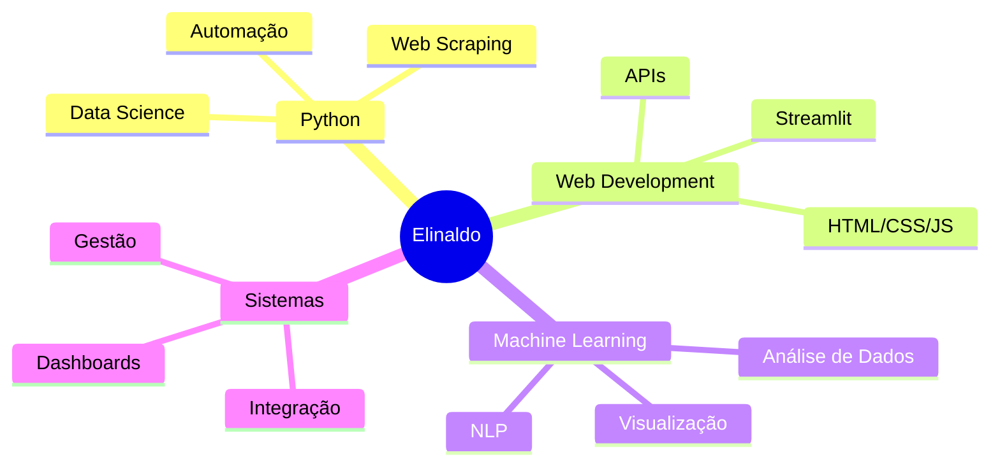

# 👨🏻‍💻 Elinaldo Cavalcanti

### Desenvolvedor Full Stack | Python, Web & Automação

---

## 🚀 Sobre Mim

Sou desenvolvedor Full Stack apaixonado por tecnologia e por criar **soluções práticas, eficientes e escaláveis**.

Atuo principalmente com **Python** integrado ao desenvolvimento web, construindo desde **sites modernos e responsivos** até **dashboards interativos e analíticos com Streamlit**, voltados para indicadores, métricas e apoio à tomada de decisão.

### 💡 Experiências e Competências

- 🤖 **Chatbots Inteligentes:** IA integrada com bancos de dados SQLite
- 📊 **Dashboards Analíticos:** Streamlit para visualização de métricas e KPIs
- 🏥 **Sistemas de Gestão:** Controle de estoque hospitalar com alertas automatizados
- ⚙️ **Automação Python:** Web scraping, processamento de documentos e integração com Excel
- 📚 **Estudando:** NLP, Machine Learning e Visualização de Dados
- 🎯 **Objetivo:** Transformar conhecimento técnico em soluções reais de impacto

---

## 🛠️ Stack Tecnológico

### Linguagens & Frameworks

### Bibliotecas & Ferramentas

---

## 📌 Projetos em Destaque

<table align="center">
<tr>
<td width="50%">
<h3 align="center">📊 Dashboard de Vendas</h3>

Dashboard interativo com Streamlit para análise de métricas de vendas e KPIs

</td>

<td width="50%">
<h3 align="center">🤖 Chatbot IA</h3>

Chatbot inteligente com integração de IA e banco de dados SQLite

</td>
</tr>

<tr>
<td width="50%">
<h3 align="center">🏥 Gestão Hospitalar</h3>

Sistema de controle de estoque com alertas e relatórios automatizados

</td>

<td width="50%">
<h3 align="center">⚙️ Painel de Automação</h3>

Automação completa: web scraping, processamento e envio de emails

</td>
</tr>
</table>

---

## 📊 Estatísticas GitHub

---

## 🎯 Áreas de Interesse

---

## 💬 Citação Favorita

> *"A tecnologia move o mundo, mas são as pessoas que dão significado a ela."*

---

## 📫 Vamos Conversar?

Estou sempre aberto a novos projetos, colaborações e oportunidades!

---

